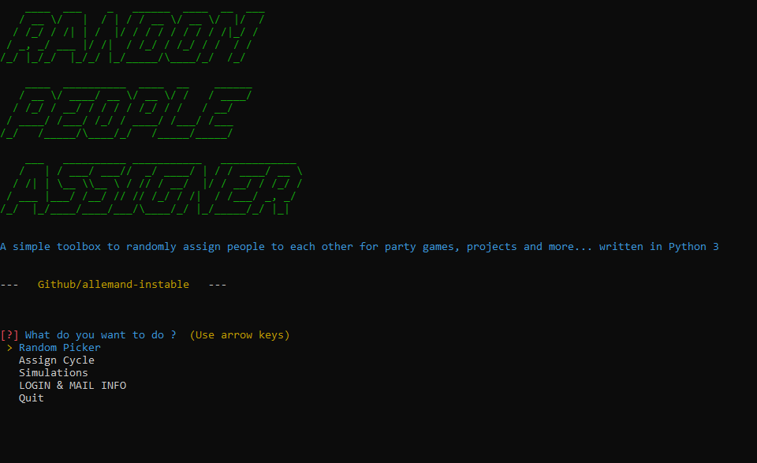

# Random-People-Assigner

 A simple Toolbox to randmoly assign a set of people to others ( of the same group ), sending them an email to know with whom they have been assigned - Perfect for Secret Santas, Killer party game, etc...

## How to use

### set up the mail

> I DO recommend creating another e-mail, like a dev email whose purpouse is to send emails through programs/scripts.
> please make sure your gmail account allows 'LESS SECURE APPS' : https://myaccount.google.com/lesssecureapps

### people info

### main menu

#### Assign Cycle

Makes a cycle

#### Random Picker

Assign Randomly someone to another person

### change your login and message info

#### or directly via txt :

##### login

##### message

### default paramaters (need to be changed)

## Changelog

### 2.0

- Restructured
  - now functions are separated into packages 
- rework of Random People Assigner function
  - uses Z/nZ to get a different person
  - much cleaner and readable code
### 1.0

- first version